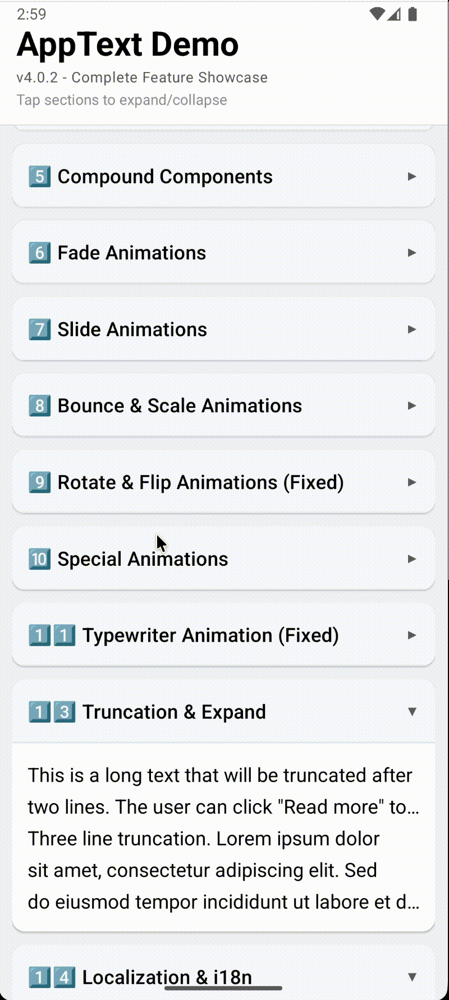

# 🌟 React Native AppText

<div align="center">

**The Ultimate Typography & i18n Engine for React Native**
_Beautiful text. Global-ready. Blazing fast._

<br/>

[](https://www.npmjs.com/package/react-native-apptext)
[](https://www.npmjs.com/package/react-native-apptext)
[-6a5acd?style=for-the-badge>)]()
[](https://www.typescriptlang.org/)
[](https://developer.mozilla.org/en-US/docs/Web/JavaScript)

<br/>

[📖 Docs](https://github.com/Ganesh1110/react-native-apptext/wiki) •
[🐛 Issues](https://github.com/Ganesh1110/react-native-apptext/issues) •
[💡 Features](https://github.com/Ganesh1110/react-native-apptext/issues)

</div>

---

## 🎬 Preview

<!-- Hero Demo -->
<p align="center">
  
</p>
<p align="center">
  <strong>🌍 Localization & RTL Support</strong>
</p>

<br/>

<!-- Animations Grid -->
<p align="center">
  
  
  
</p>
<p align="center">
  <sub>Bounce • Fade • Slide</sub>
</p>

<br/>

<p align="center">
  
  
  
</p>
<p align="center">
  <sub>Rotate • Special • Typewriter</sub>
</p>

---

## ⚡ Why AppText?

React Native text is harder than it should be:

- ❌ Broken RTL layouts
- ❌ Poor animation performance
- ❌ Complex i18n setup
- ❌ Large translation bundles

### ✅ AppText fixes it — by default

- 🌍 50+ languages & scripts (RTL + LTR)
- ⚡ 60FPS animations
- 🧠 LRU-cached translations (95%+ hit rate)
- 📦 Lazy-loaded i18n
- 🎨 Material Design 3 typography
- 🛡️ Built-in error boundaries

---

## 📊 Performance

| Metric          | AppText | React Native |
| --------------- | ------- | ------------ |
| Render (Latin)  | 4.2ms   | 6.8ms        |
| Render (Arabic) | 5.1ms   | 12.3ms       |
| Memory          | 2.8MB   | 4.1MB        |
| Lookup          | 0.8ms   | —            |

⚡ **Up to 58% faster rendering**

---

## ⚡ Quick Start

```bash
npm install react-native-apptext
# or
yarn add react-native-apptext
```

### 30-second example

```tsx
import AppText, { AppTextProvider } from "react-native-apptext";

export default function App() {
  return (
    <AppTextProvider>
      <AppText.DisplaySmall>Welcome</AppText.DisplaySmall>

      <AppText.BodyMedium color="secondary">
        Fast. Beautiful. Global-ready.
      </AppText.BodyMedium>

      <AppText.LabelSmall mt={8}>60FPS • i18n • 50+ scripts</AppText.LabelSmall>
    </AppTextProvider>
  );
}
```

👉 **No native setup required**

---

## 🌍 Built-in i18n (Zero Config)

```tsx
import { LocaleProvider, useLang } from "react-native-apptext";

const translations = {
  en: { items: "{count, plural, one {# item} other {# items}}" },
  ar: { items: "{count, plural, zero {لا عناصر} other {# عنصر}}" },
};

function App() {
  return (
    <LocaleProvider translations={translations}>
      <AppTextProvider>
        <Home />
      </AppTextProvider>
    </LocaleProvider>
  );
}

function Home() {
  const { t } = useLang();
  return <AppText>{t("items", { count: 5 })}</AppText>;
}
```

---

## 🎨 Typography System

Material Design 3 built-in:

```tsx
<AppText.DisplayLarge />
<AppText.HeadlineSmall />
<AppText.BodyMedium />
<AppText.LabelSmall />
```

Custom:

```tsx
<AppText variant="bodyMedium" weight="semibold" color="primary">
  Custom Text
</AppText>
```

---

## ✨ Animations (60FPS)

```tsx
// Simple usage
<AppText animation="fadeIn">Fade In</AppText>
<AppText animation="slideInRight">Slide</AppText>

// Custom configuration
<AppText 
  animation="pulse" 
  animationConfig={{ duration: 2000, delay: 500 }}
>
  Pulse
</AppText>

<AppText animation="typewriter" animationSpeed={40}>Typing...</AppText>
```

---

## ⚡ Performance Features

- 🚀 LRU Cache (95%+ hit rate)
- 📦 Lazy-loaded translations
- 🎯 Namespace code-splitting
- 🛡️ Error boundaries
- 📊 Built-in performance monitor

---

## 🧩 Advanced Features

- 🌐 Automatic script detection (Arabic, Hindi, Japanese…)
- 🔤 Rich text via `<Trans />`
- 📉 Truncation + “Read more”
  ```tsx
  <AppText maxLines={3} truncateText>Long text here...</AppText>
  ```
- 🔗 Link Detection
  ```tsx
  <AppText linkDetection onLinkPress={url => Linking.openURL(url)}>
    Visit https://google.com
  </AppText>
  ```
- ♿ Accessibility-first (Dynamic Type, ARIA roles)
- 🎨 Spacing props (m, p, mx, py)

---

## 📚 API Reference

| Prop | Type | Default | Description |
| --- | --- | --- | --- |
| `variant` | `TypographyVariant` | `undefined` | MD3 or Legacy variant |
| `animation` | `AnimationType \| boolean` | `undefined` | The animation to play |
| `animationConfig` | `AnimationConfig` | `{}` | Duration, delay, speed |
| `maxLines` | `number` | `undefined` | Line limit (replaces numeric `truncate`) |
| `truncateText` | `boolean` | `false` | Shows ellipsis when truncated |
| `linkDetection` | `boolean` | `false` | Auto-detect and style URLs |
| `onLinkPress` | `(link: string) => void` | `undefined` | Callback for link clicks |

## 🔄 Migration Guide (v4.1 → v4.2)

### 1. Truncation
- **Legacy:** `<AppText truncate={3}>`
- **Modern:** `<AppText maxLines={3} truncateText>`

### 2. Animations
- **Legacy:** `<AppText animation={{ type: 'fade', duration: 500 }}>`
- **Modern:** `<AppText animation="fade" animationConfig={{ duration: 500 }}>`

## 📚 Documentation

👉 Full API & advanced usage:
[https://github.com/Ganesh1110/react-native-apptext/wiki](https://github.com/Ganesh1110/react-native-apptext/wiki)

---

## 🤝 Contributing

```bash
git clone https://github.com/Ganesh1110/react-native-apptext.git
cd react-native-apptext
npm install
npm test
```

---

## 📄 License

MIT © Ganesh1110

---

<div align="center">

**Built with ❤️ for React Native developers**

</div>
